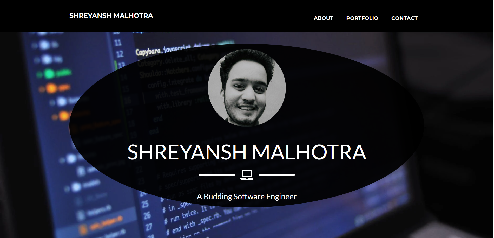
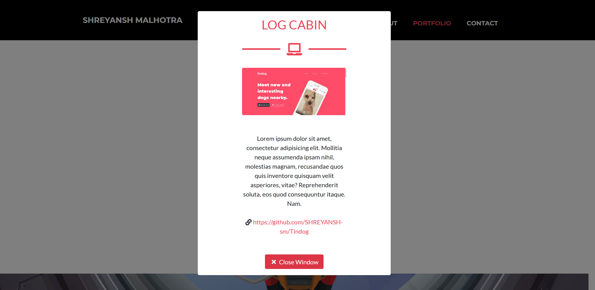

# Shreyansh Portfolio Website
This is a Responsive Portfolio Website made with HTML, CSS, Bootstrap4 and JavaScript.Feel free to copy, get ideas, no copyright issues. 

## Developed By 
> Nishkarsh Dubb and Shreyansh Malhotra

## Screenshots 📷

## Live Demo 

 

## Developed Using 💻

+ [Html](https://developer.mozilla.org/en-US/docs/Web/HTML)
+ [Css](https://developer.mozilla.org/en-US/docs/Web/CSS)
+ [Bootstrap](https://getbootstrap.com/)
+ [Javascript](https://developer.mozilla.org/en-US/docs/Web/javascript)

## Installation or Getting Started

Run the following command in the terminal:

	git clone https://github.com/Nishkarsh01/shreyansh-portfolio.git
or download the zip file from github.
    

## Usage
After extracting the files,

    cd shreyansh-portfolio
    open index.html

## Collaborate
To collaborate, reach us on [nishdubb11@gmail.com](), [shreyanshdeveloper.sm@gmail.com]()

## Further help/Reference

+ [MDN Web Docs](https://developer.mozilla.org/en-US/)
+ [getbootstrap.com](https://getbootstrap.com/)
+ [w3schools.com](https://www.w3schools.com/)
    

